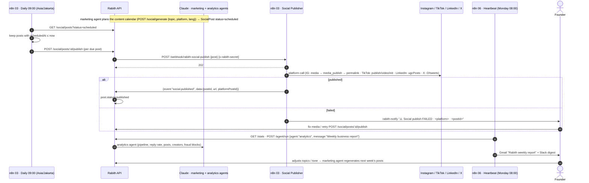

# Rabith · Brain ↔ Hands protocol (Claude ⇄ n8n)

> **Brain** = Claude: the orchestrator + 20 specialist agents in `apps/api` (`POST /agent/run`).
> **Hands** = n8n: channels, schedulers, scrapers, notifications — the workflows in [`n8n/workflows`](../n8n/workflows).
> Contract: [`docs/API.md`](./API.md) (§ n8n events). Setup & testing: [`n8n/README.md`](../n8n/README.md).

The rule of thumb: **Claude decides, n8n executes, the API is the memory.**
n8n never holds business state of its own — every step reads/writes the API so a workflow can be replayed, restarted or replaced.

## 1. Sequence diagrams

### (a) Brand lead → orchestrator → outreach sequence

```mermaid
sequenceDiagram
    autonumber
    actor Brand as Brand (web form)
    participant N02 as n8n 02 · Inbound Lead
    participant API as Rabith API
    participant Claude as Claude · orchestrator
    participant N01 as n8n 01 · Outreach Sequencer
    participant Ch as Gmail / WhatsApp / LinkedIn
    actor F as Founder

    Brand->>N02: POST /webhook/rabith-lead {company,name,email,…}
    N02->>N02: normalise + honeypot + e-mail check (UU PDP: keep business fields only)
    N02-->>Brand: 200 "Terima kasih"
    N02->>API: POST /webhooks/n8n {event:"lead.new", data: Brand partial}  [x-rabith-secret]
    API->>API: upsert brand, pipeline=lead, source=n8n
    N02->>API: GET /brands?q=name&pipeline=lead → brandId
    N02->>API: POST /agent/run {agent:"orchestrator", message:"Qualify this lead and draft the first outreach", context:{brandId}}
    API->>Claude: plan → discovery / brand-research / copywriter agents
    Claude-->>API: AgentRun {output: qualification + draft, steps[]}
    API-->>N02: AgentRun
    N02->>F: rabith-notify (Slack/WhatsApp) "🆕 New lead … <agent output>"
    F->>API: approves draft in dashboard → POST /outreach then POST /outreach/:id/send
    API->>N01: POST /webhook/rabith-outreach-send {outreach, brand, contact}  [x-rabith-secret]
    N01-->>API: 202 accepted
    N01->>Ch: send (Gmail / WhatsApp Cloud API / LinkedIn manual task)
    N01->>API: {event:"outreach.sent", data:{outreachId, sentAt, channel}}
    Note over N01: Wait 4 days
    N01->>API: GET /brands/:id · GET /outreach?brandId=
    alt reply received (outreach.replied / pipeline moved)
        N01-->>N01: stop
    else no reply
        N01->>API: POST /outreach/generate {templateId:"followup1_<lang>", personalize:true}
        API->>Claude: personalise follow-up
        N01->>API: POST /outreach {sequenceStep:1} · POST /outreach/:id/send
        API->>N01: rabith-outreach-send (step 1) — new execution
        Note over N01: send → Wait 8 days → same check → followup2 (step 2) → send → STOP (max 2 follow-ups)
    end
    Ch-->>N01: reply (Gmail poll / WhatsApp inbound webhook)
    N01->>API: {event:"outreach.replied", data:{outreachId, text}}
    API->>Claude: negotiation agent drafts the answer; brand → replied
    N01->>F: rabith-notify "💬 Reply on or_… via email"
```

### (b) Campaign → matching → creator invites via WhatsApp → contract → escrow

```mermaid
sequenceDiagram
    autonumber
    actor F as Founder / Brand user
    participant API as Rabith API
    participant Claude as Claude · orchestrator + agents
    participant N01 as n8n 01 · Outreach Sequencer
    participant WA as WhatsApp Cloud API
    actor C as Creator
    participant N07 as n8n 07 · Notify

    F->>API: POST /campaigns {brandId, objective, budgetIDR, kpi, platforms, niches, tiers}
    F->>API: POST /campaigns/:id/match {limit:20}
    API->>Claude: matching agent (score: niche·audience·engagement·budget·trust·platform·location)
    Claude-->>API: matches[] + plan {selected[], totalCostIDR, expectedReach}
    Note over API,Claude: fraud agent has veto: creators with fraudScore ≥ 60 never enter plan.selected (nightly n8n 05 keeps scores fresh)
    F->>API: PATCH /campaigns/:id {status:"outreach"}
    loop for each selected creator
        API->>Claude: copywriter → creator_invite_id template (WhatsApp, Bahasa)
        API->>API: POST /outreach {channel:"whatsapp", templateId:"creator_invite_id"}
        API->>N01: rabith-outreach-send {outreach, contact:{whatsapp}}
        N01->>WA: POST /v20.0/{phoneNumberId}/messages {to, text}
        N01->>API: outreach.sent {outreachId}
    end
    C->>WA: "YA"
    WA->>N01: POST /webhook/rabith-whatsapp-inbound (Meta payload)
    N01->>API: outreach.replied {outreachId, text:"YA"}
    API->>Claude: negotiation agent → agrees deliverable + feeIDR within plan budget
    Claude-->>API: terms {deliverable, feeIDR, deadline}
    API->>Claude: legal/contracts agent → contract (ID/EN), brand-safety clauses
    API->>N07: rabith-notify "📄 Contract ready for @creator — approve?"
    F->>API: approve → contract signed (e-sign link sent via N01 WhatsApp)
    API->>Claude: payments/escrow agent → escrow hold of feeIDR (payment gateway)
    API->>N01: rabith-outreach-send (brief + escrow confirmation to creator)
    C->>API: content delivered (upload URL)
    API->>Claude: vision agent POST /vision/analyze {task:"brand_safety"|"product_detection"}
    Claude-->>API: score ≥ threshold → release escrow; else request revision
    API->>N07: rabith-notify "✅ Escrow released to @creator · Rp…"
```

### (c) Social page management loop (@rabith.id)



## 2. Responsibilities split

| Concern | Claude (brain, in the API) | n8n (hands) |
|---|---|---|
| Lead qualification | Decides hot/warm/cold, picks template, drafts the first message | Receives the form, validates, upserts via `lead.new`, calls the orchestrator, pings the founder |
| Outreach | Personalises every message (`/outreach/generate`, `personalize:true`), chooses language (ar/en/id) and channel | Sends it (Gmail / WhatsApp / LinkedIn task), reports `outreach.sent`, waits +4 d / +8 d, asks for the follow-up, captures replies |
| Follow-up limit | — | **Hard rule in n8n**: `sequenceStep ≥ 2` ends at *Sequence complete*; the follow-up branch also refuses to create a step that already exists |
| Creator discovery | Decides *what* to look for (`rabith-discovery-scan {query, platform, niche}`) and scores fit later | Runs the scraper/enrichment API, maps rows to the `Creator` schema, posts `creator.discovered` in batches of 25 |
| Fraud | Computes `fraudScore` and flags from signals; fraud agent writes the nightly anomaly brief; has veto in matching | Collects raw signals every night (top 200 by followers) and on demand (`rabith-fraud-audit`), posts `fraud.result` |
| Matching / negotiation / contracts / escrow | All decisions: shortlist, fee, terms, clauses, release/hold | Delivers messages, e-sign links and confirmations; notifies the founder at every approval gate |
| Social | Writes captions/hashtags/best time (`/social/generate`), plans the calendar | Publishes at 09:00 daily via the API, reports `social.published`, alerts on failures |
| Reporting | Analytics agent writes the weekly narrative | Collects `/stats`, triggers the agent, e-mails the report |
| Health | — | Hourly `/health`, alert on `down` or `offline` mode (de-duplicated 6 h), recovery notice |
| Approval gates | Proposes | Never sends money, signs contracts or publishes on a brand's account without the API having recorded a founder/brand approval |

Anything that needs judgement is a `POST /agent/run` call from n8n (allowed by the contract: *"n8n may also call /agent/run directly"*).
Anything that needs a credential to the outside world lives in n8n.

## 3. Message contract recap

Outbound **API → n8n** (`POST $N8N_WEBHOOK_BASE/<path>`, header `x-rabith-secret`):

| Path | Workflow | Payload | n8n answers |
|---|---|---|---|
| `rabith-outreach-send` | 01 | `{ outreach, brand, contact }` | `202 { ok, accepted: outreachId, step }` |
| `rabith-social-publish` | 03 | `{ post }` | `202 { ok, accepted: postId }` |
| `rabith-discovery-scan` | 04 | `{ query, platform, niche }` | `202 { ok, accepted }` |
| `rabith-fraud-audit` | 05 | `{ creatorIds[] }` | `202 { ok, accepted: n }` |
| `rabith-notify` | 07 | `{ channel, text }` | `200 { ok }` |
| *(public)* `rabith-lead` | 02 | form fields / Typeform / Tally | `200` or `400 { error }` |
| *(public)* `rabith-whatsapp-inbound` | 01 | Meta Cloud API payload (GET handshake + POST) | `200` |

Inbound **n8n → API** (`POST /api/webhooks/n8n { event, data }`, header `x-rabith-secret`):

| event | posted by | idempotency key |
|---|---|---|
| `lead.new` | 02 | brand `name` + contact `email` (API upserts) |
| `outreach.sent` | 01 | `outreachId` (+ `sequenceStep`) |
| `outreach.replied` | 01 | `outreachId` + `messageId` |
| `creator.discovered` | 04 | `handle` + `platform` per creator (API upserts) |
| `social.published` | 03 | `postId` |
| `fraud.result` | 05 | `creatorId` + `signals.auditedAt` |

## 4. Retry & idempotency rules

1. **The API is the source of truth.** n8n keeps no counters, no lists, no "already sent" sets — except the 6-hour alert cooldown in 06 (workflow static data, harmless to lose).
2. **Idempotency keys travel in the payload** (`outreachId`, `postId`, `creatorId`, `handle+platform`, `name+email`). The API must treat a repeated event with the same key as a no-op update, never as a duplicate insert. n8n may legitimately deliver the same event twice (retry after a timeout whose request actually succeeded).
3. **Before acting, n8n re-reads state**: 01 checks `outreach.status/sentAt` before sending (`route = skip`), and re-reads brand + outreach list after every wait before generating a follow-up. 03's scheduler only publishes `status=scheduled`.
4. **Retries**: HTTP calls to the API retry 3× with 2 s back-off (`retryOnFail`). Calls to `/agent/run` retry **0×** — a Claude run is expensive and not idempotent. Channel calls (WhatsApp, Meta, LinkedIn, X, Apify, fraud API) *continue on error*; the failure is turned into a notification, not an n8n execution crash, so the loop/sequence keeps going.
5. **One execution per sequence step.** A follow-up is created through the API (`POST /outreach` + `/send`), which triggers a *new* execution of 01. Long-lived executions therefore contain at most one Wait node (4 d or 8 d), and an n8n restart or redeploy in between loses nothing.
6. **Golden rule enforced twice**: `followup2` is the last template (`sequenceStep 2 → Sequence complete`), and the reply-check refuses to create a step that already exists for the contact.
7. **Batches**: `creator.discovered` ≤ 25 creators per POST; fraud audit loops in batches of 10 creators; the daily social scheduler publishes each due post in its own API call so one failure does not block the rest.
8. **Time**: all schedules run in `Asia/Jakarta`; timestamps in payloads are ISO-8601 UTC (`$now.toISO()`).

## 5. Security

* **Shared secret both ways.** `x-rabith-secret: $RABITH_WEBHOOK_SECRET` on every API→n8n webhook and on every n8n→API request. The first node after each webhook trigger is an IF that returns **401** on mismatch; `n8n/validate.js` fails the build if an API call omits the header. Rotate the secret by changing it in both `.env` files at once — no workflow edit needed (`$env`).
* **Public endpoints are minimal.** Only `rabith-lead` and `rabith-whatsapp-inbound` accept unsigned traffic. `rabith-lead` validates, honeypots and only forwards a fixed set of business fields; `rabith-whatsapp-inbound` verifies Meta's `hub.verify_token` and only reacts to messages whose sender matches a stored contact. Rate-limit both at the reverse proxy.
* **Credentials never leave n8n.** Gmail, WhatsApp, Meta, LinkedIn, X, Slack tokens live in n8n credentials; the API only knows the shared secret and its Anthropic key.
* **UU PDP (Indonesian personal-data law) — data minimisation.**
  * n8n forwards only what the `Brand` / `Creator` schema needs: name, role, business e-mail, LinkedIn URL, WhatsApp, language. Raw form bodies, Gmail message bodies beyond a 2 000-char snippet, and scraped private fields are dropped in the Code nodes.
  * Creators discovered are limited to **public** business contact fields (`contact.email`, `contact.whatsapp` only when the profile exposes them); bios are truncated to 300 chars; nothing is collected from DMs or comments.
  * Executions containing personal data should not be kept forever: set `EXECUTIONS_DATA_PRUNE=true` and `EXECUTIONS_DATA_MAX_AGE=336` (14 days) on the n8n container; the API record is the retained copy.
  * Contacts can ask for deletion → delete in the API (`PATCH /brands/:id` with the contact removed); no copy exists in n8n after pruning.
  * Outreach respects the "two follow-ups maximum" rule and stops on any reply or bounce — the same rule that keeps Rabith's sender reputation intact.
* **Least privilege on tokens**: Gmail scope send + read-only inbox; WhatsApp system-user token limited to the one phone number; IG/LinkedIn/X tokens limited to the @rabith.id accounts; Slack bot with `chat:write` only.

## 6. Adding a new "hand"

1. Add the outbound path or inbound event to `docs/API.md` first (the validator reads it).
2. Copy the trigger block (`Webhook → Verify secret → Respond 401/202`) from any workflow.
3. Post results back with an explicit `event` and an idempotency key in `data`.
4. Notify through `rabith-notify`, not directly, so the founder's channel preference stays in one place.
5. Run `node n8n/validate.js`.
